## Install brew in macOS
    `/bin/bash -c "$(curl -fsSL https://raw.githubusercontent.com/Homebrew/install/HEAD/install.sh)"`
    It will be added to zsh path, open a new zsh terminal to run `brew`
    
## Install python in macOS
    `brew install python`
    You may need to run specific version as: `python3.13 --version`

## Create a virtual environment
    `python3.13 -m venv ../venv_3.13`
    `source ../venv_3.13/bin/activate`

## Install required python packages into virtual environment
    after activate the virtual environment
    `python -m pip install -r requirements.txt`

## Download model files from git
* install git-lfs:
    `brew install git-lfs`
    `git lfs install`
* pull the lfs files
    `git lfs pull`

## Check in a large model file to git
`git lfs track "*.pth"`
`git lfs track "*.bin"`
This will update `.gitattributes`

or
```
cd /Users/<user>/workspace/latent_space_image_manager
git lfs track "*.pth"
git add .gitattributes
git commit -m "Track .pth files with Git LFS"
git add models/sam_vit_b_01ec64.pth
git commit -m "Add model to LFS"
git push origin main
```
## How to run the image generation
eg. `python processimage.py lol_sam images/input/car1.png car1_lol_sam_results`

## Sample images

### Original image


### DOD sample
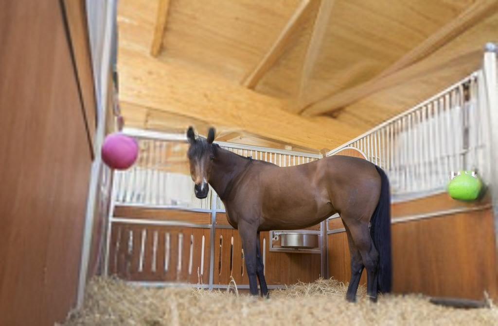

### SAM sample


### LOL-FADE sample
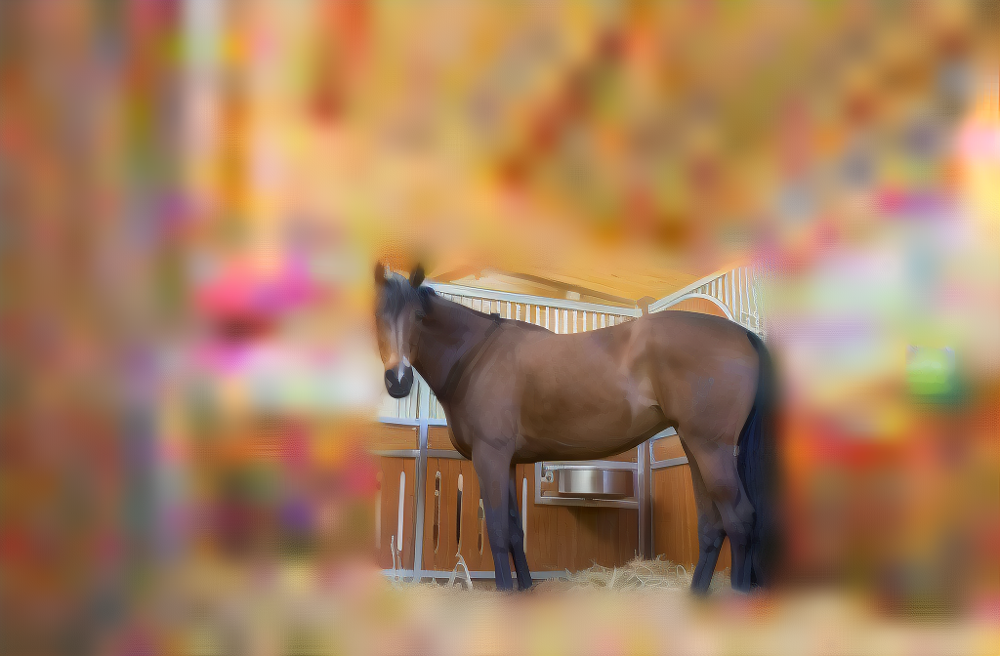

### LOL-SAM sample
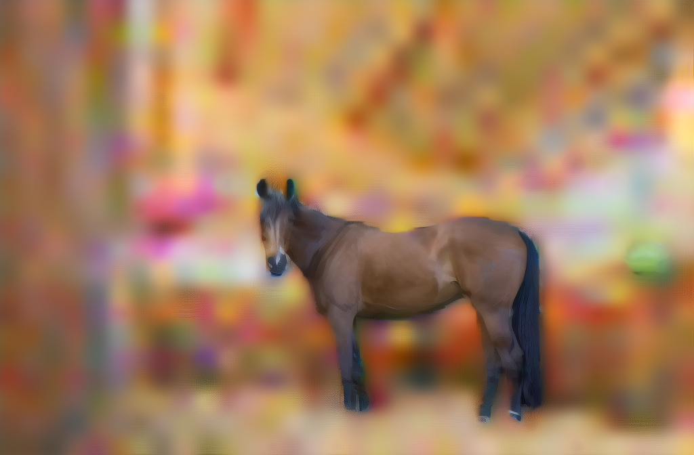

### Stylish effect samples
* Method: LOL-SAM
* Select only the main subject
* mask = mask / 255.0 * 2

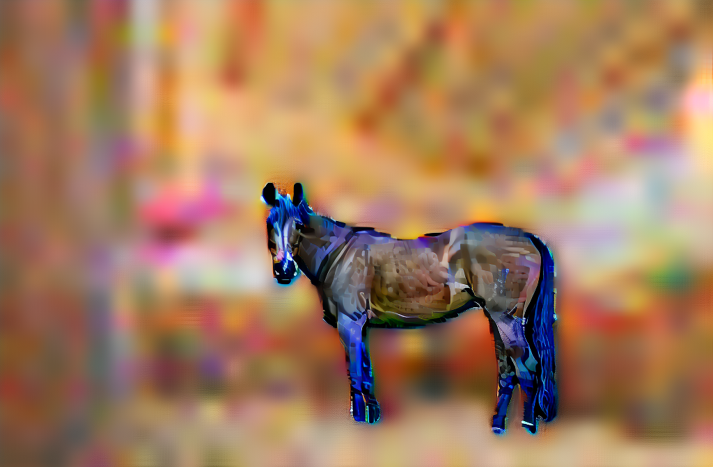

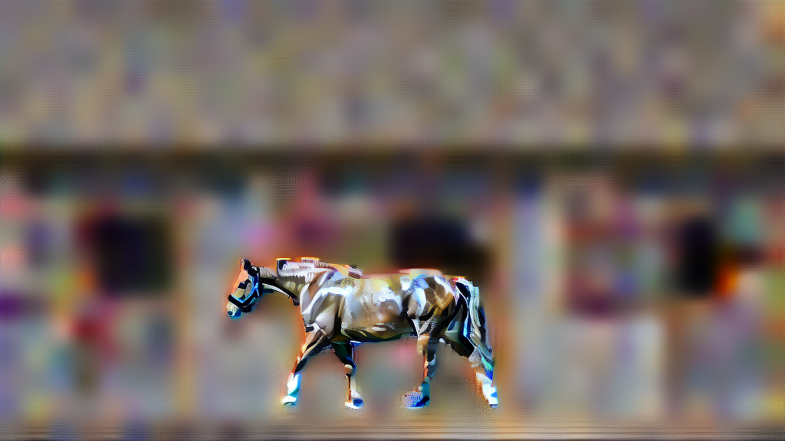


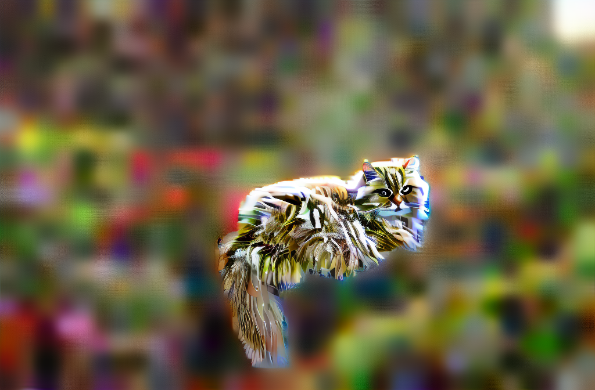

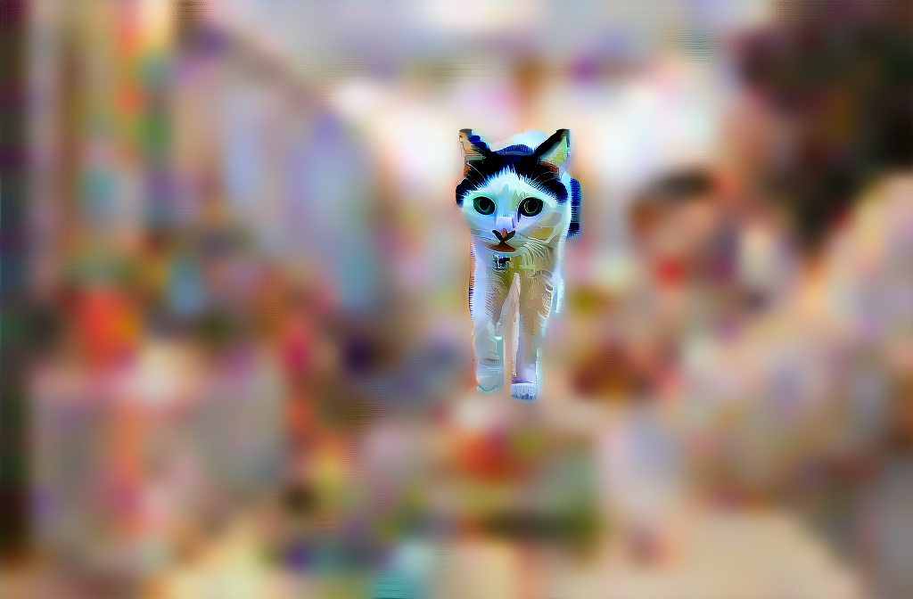

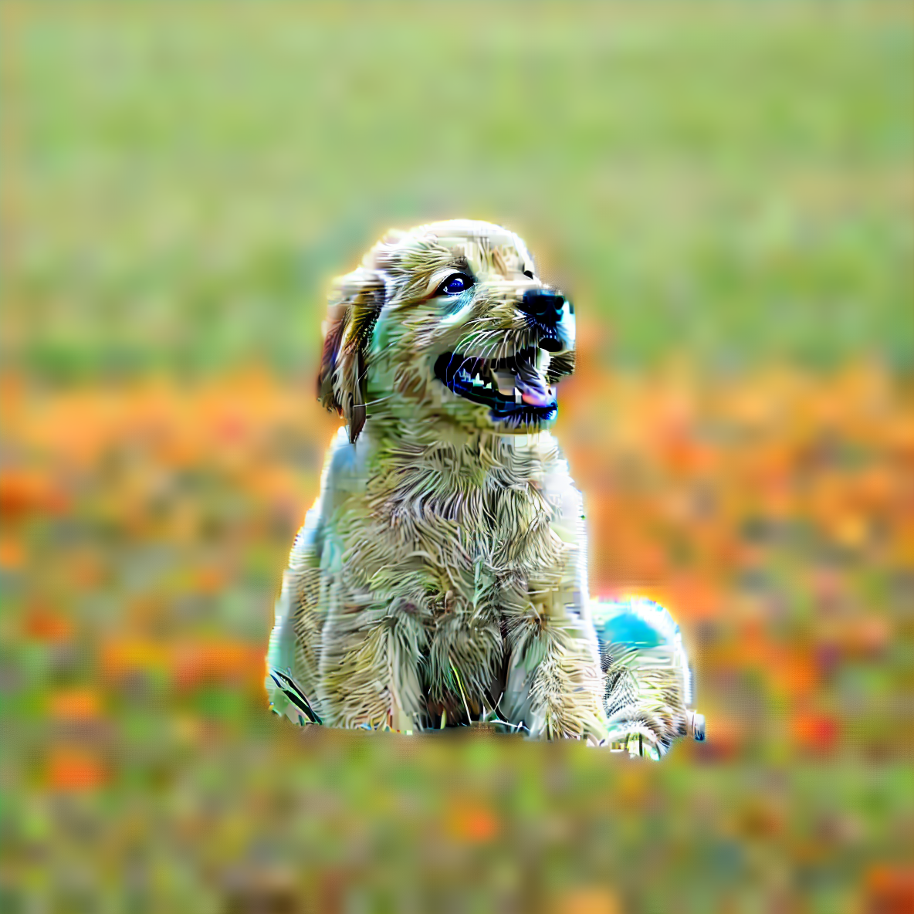

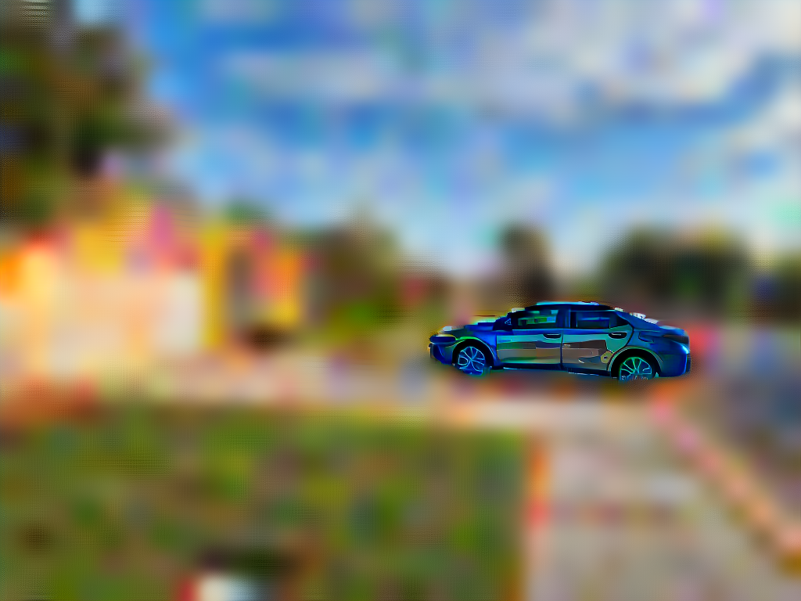

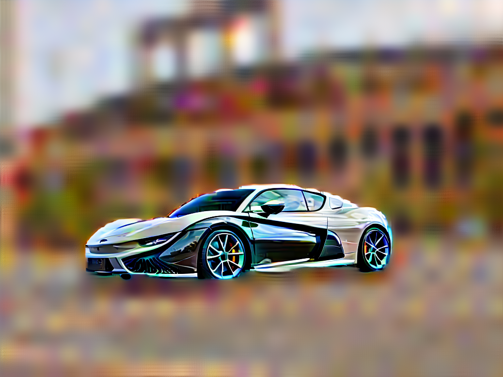

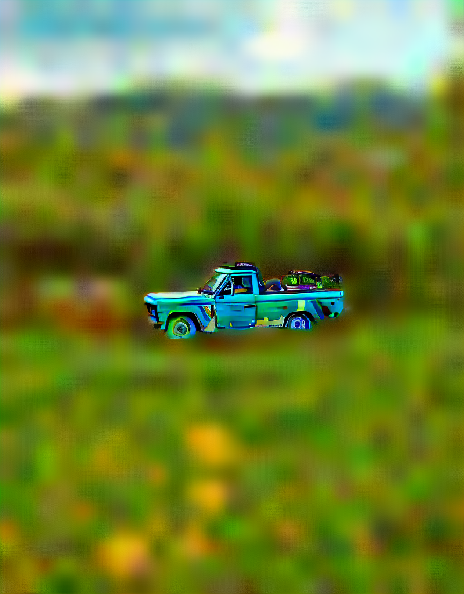

