## Install brew in macOS
    `/bin/bash -c "$(curl -fsSL https://raw.githubusercontent.com/Homebrew/install/HEAD/install.sh)"`
    It will be added to zsh path, open a new zsh terminal to run `brew`
    
## Install python in macOS
    `brew install python`
    You may need to run specific version as: `python3.13 --version`

## Create a virtual environment
    `python3.13 -m venv ../venv_3.13`
    `source ../venv_3.13/bin/activate`

## Install required python packages into virtual environment
    after activate the virtual environment
    `python -m pip install -r requirements.txt`

## Download model files from git
* install git-lfs:
    `brew install git-lfs`
    `git lfs install`
* pull the lfs files
    `git lfs pull`

## Check in a large model file to git
`git lfs track "*.pth"`
`git lfs track "*.bin"`
This will update `.gitattributes`

or
```
cd /Users/<user>/workspace/latent_space_image_manager
git lfs track "*.pth"
git add .gitattributes
git commit -m "Track .pth files with Git LFS"
git add models/sam_vit_b_01ec64.pth
git commit -m "Add model to LFS"
git push origin main
```
## How to run the image generation
eg. `python processimage.py lol_sam images/input/car1.png car1_lol_sam_results`

## Sample images

### Original image
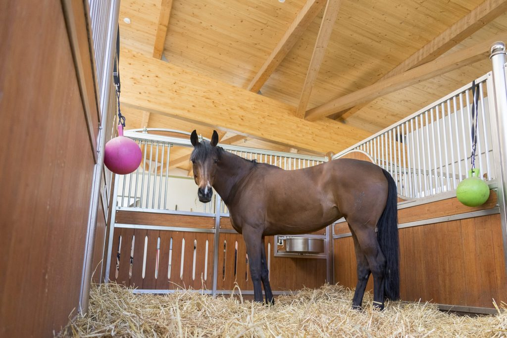

### DOD sample
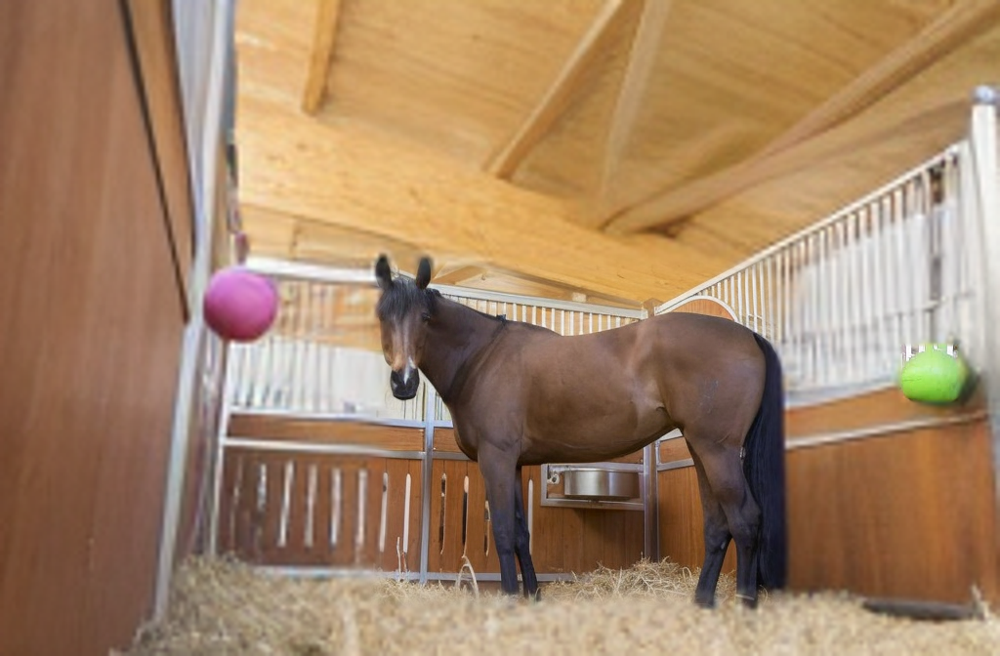

### SAM sample


### LOL-FADE sample
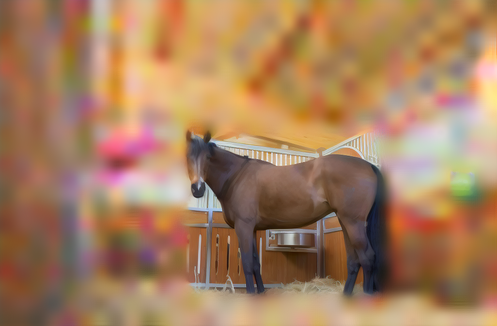

### LOL-SAM sample
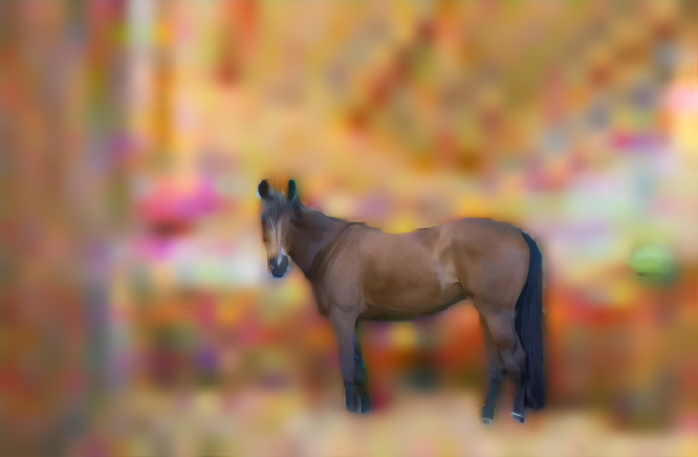

### Stylish effect samples
* Method: LOL-SAM
* Select only the main subject
* mask = mask / 255.0 * 2

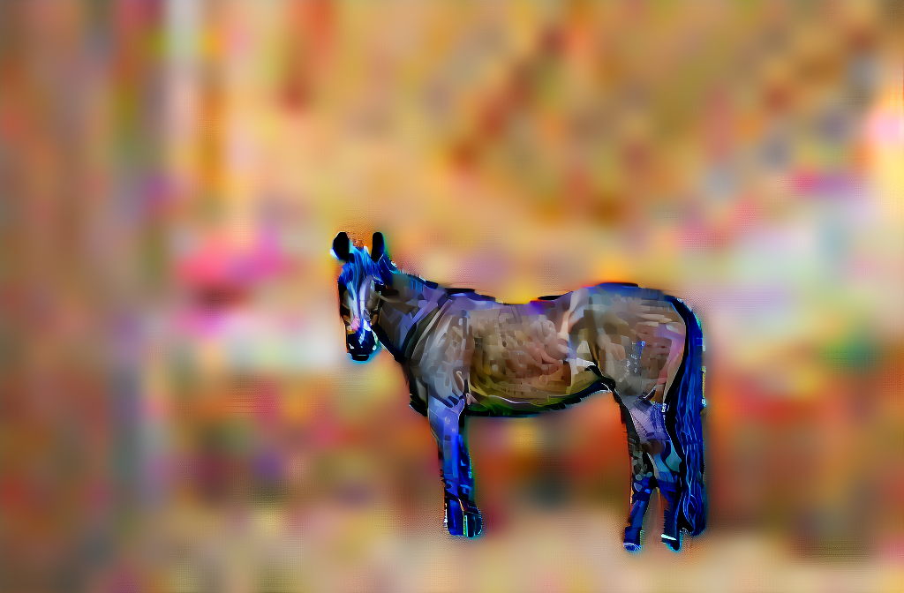

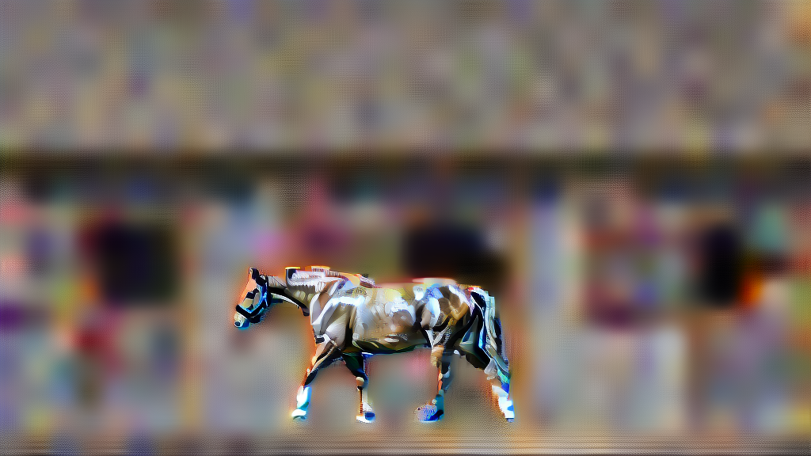

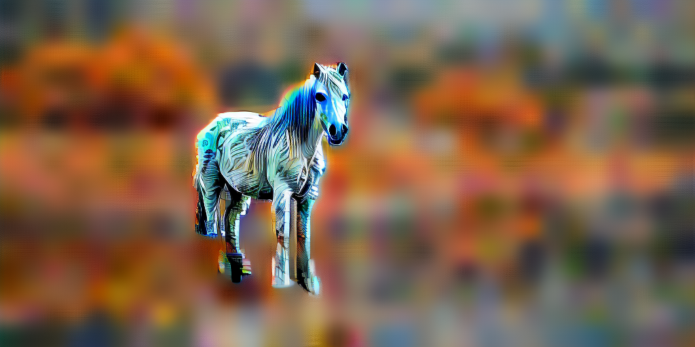

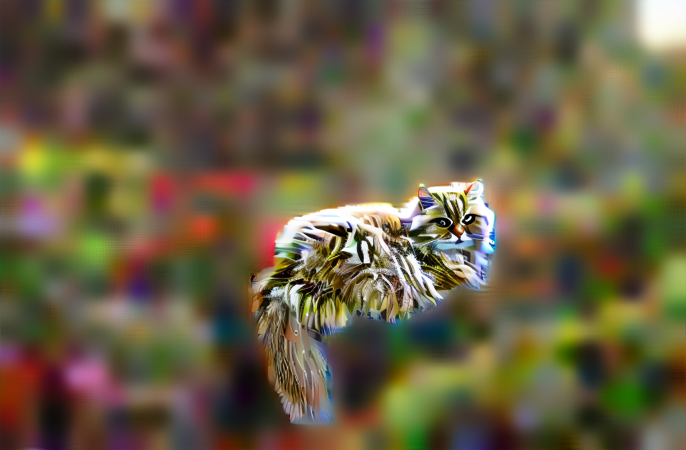

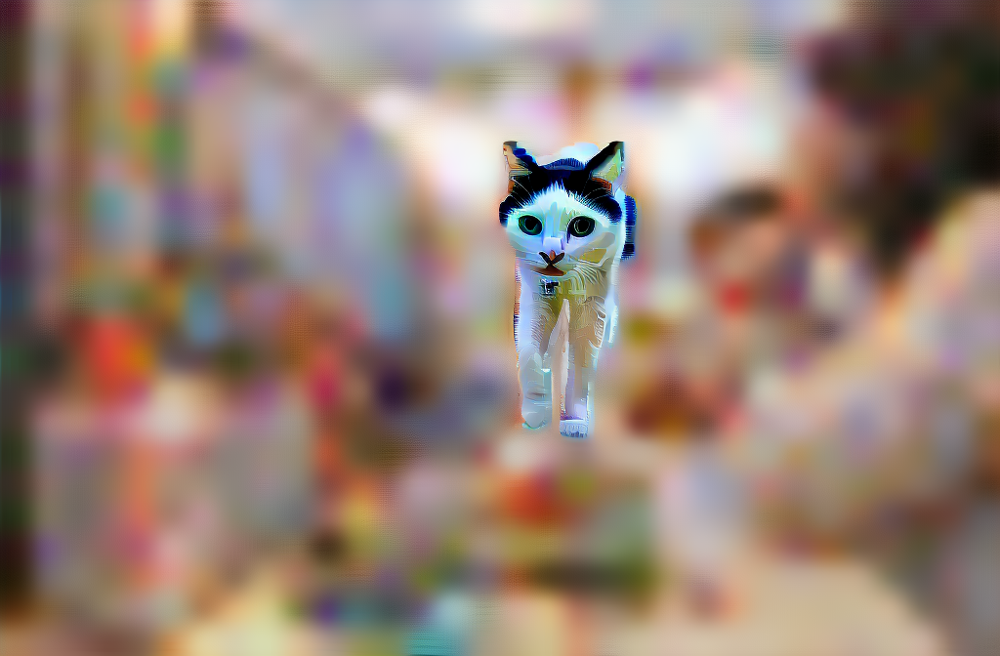

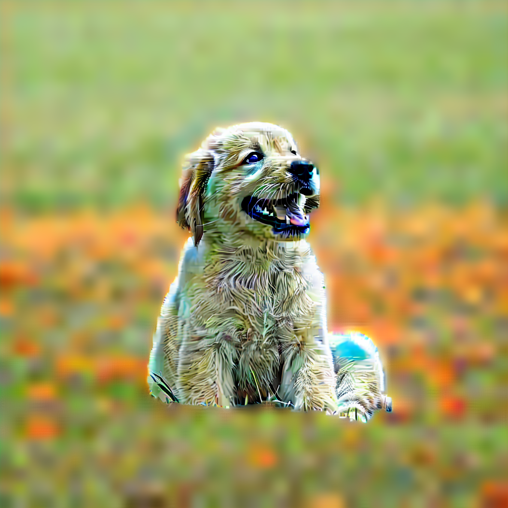

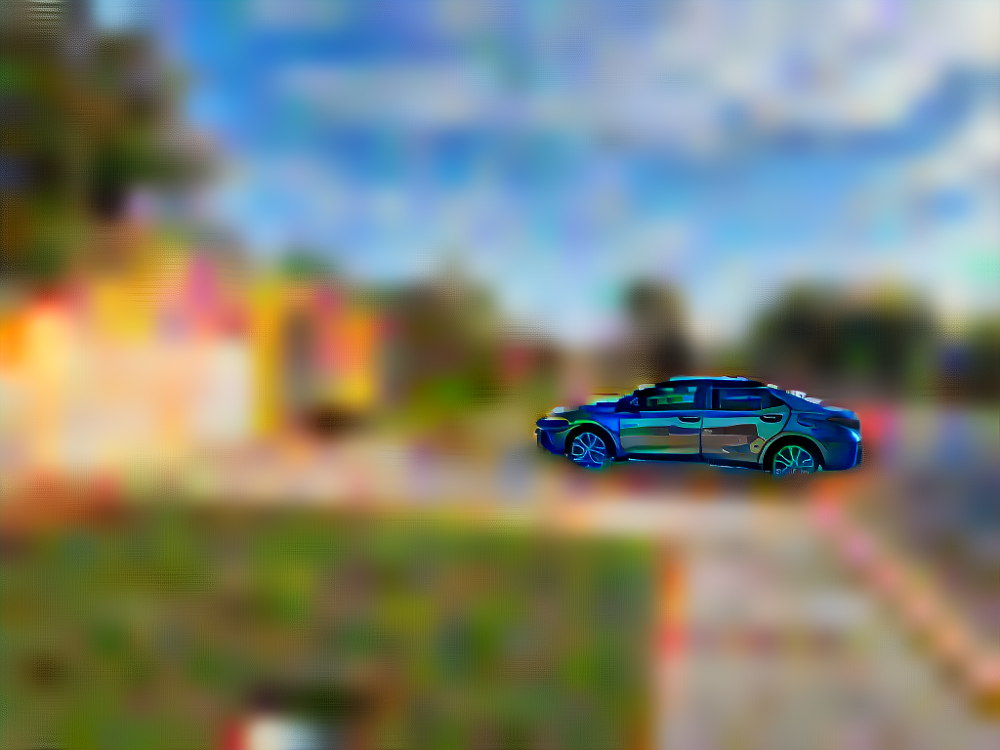

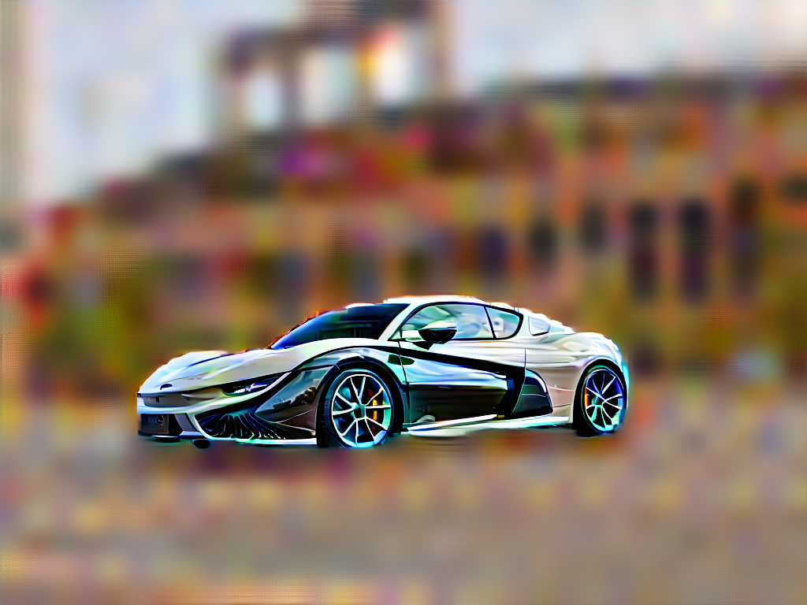

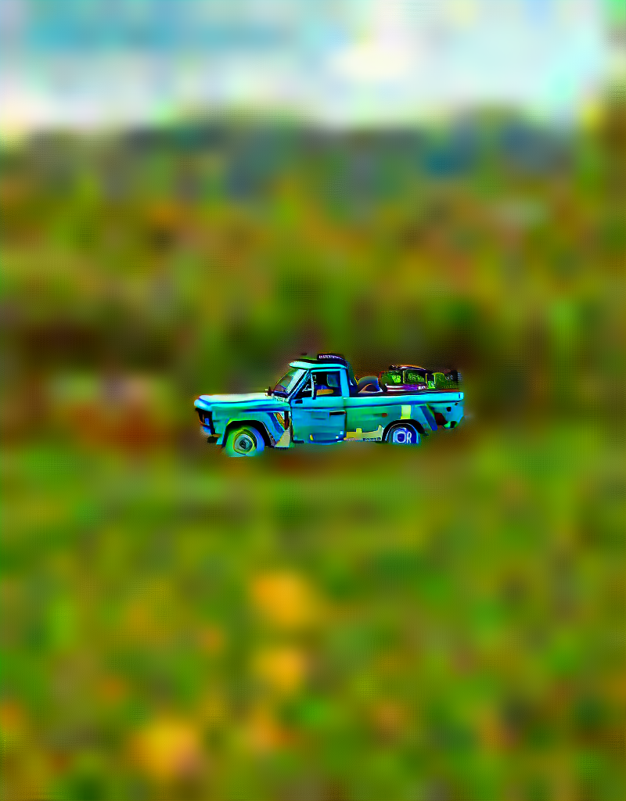

## Evaluation Results
* `images_eval` folder contains the re-organized images for the evaluation

* The following table summarizes the composite performance score for four methods across the evaluated images. Each score uses a weighted combination of edge blending, background smoothness, and object preservation.


| Image | dod_fade | dod_sam | lol_fade | lol_sam | Winner |
|---|---|---|---|---|---|
| car1.png | 0.5412 | 0.5412 | 0.6622 | 0.6733 | lol-sam |
| car2.png | 0.4782 | 0.4782 | 0.6233 | 0.6226 | lol_fade |
| car3.png | 0.5563 | 0.5563 | 0.6743 | 0.6760 | lol-sam |
| cat1.png | 0.4614 | 0.4668 | 0.6291 | 0.6484 | lol-sam |
| cat2.png | 0.3809 | 0.3809 | 0.3698 | 0.4785 | lol-sam |
| cat3.png | 0.4567 | 0.4567 | 0.5481 | 0.6378 | lol-sam |
| dog1.png | 0.7203 | 0.7203 | 0.7962 | 0.7943 | dod_fade |
| dog2.png | 0.5538 | 0.5538 | 0.6359 | 0.6390 | lol-sam |
| horse1.png | 0.4134 | 0.4135 | 0.3430 | 0.4705 | lol-sam |
| horse2.png | 0.5325 | 0.5325 | 0.6319 | 0.7150 | lol-sam |
| horse3.png | 0.5154 | 0.5154 | 0.5313 | 0.6589 | lol-sam |

